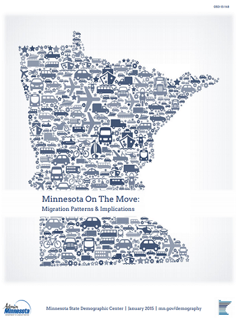
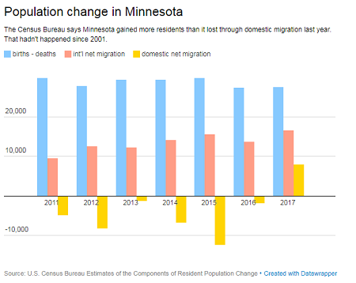

```{r setup, include=FALSE, echo=FALSE}
knitr::opts_chunk$set(echo = FALSE)
```

## Minnesota is Experiencing Net Negative Domestic Migration
<div class="columns-2">
  
  
  
</div>

## Minnesota was Experiencing Net Negative Domestic Migration?

<div align="center"></div>

<div align="center"></div>

## Migration Rates for 18 to 21 Year-olds

```{r loadtheme,include = FALSE, warning=FALSE}
load("../caches/inout_byregion.rda")

if (!exists("theme_migration")) {
  source("../presentations/theme_rmarkdown.R")
}
```

```{r netmig18to21, echo = FALSE}
####Migration rate for 18 to 21 year olds####
netmig18_pct <- filter(pct_inout_byregion, agegroup=="18 to 21") %>%
  ggplot(aes(x=geogroup, y=mig, fill=direction)) +
  theme_migration +
  geom_bar(stat="identity", position="dodge") +
  scale_fill_brewer(labels=c("Left MN for Another State", "Moved to MN from Another State"), 
                    palette="Set1"
                    ) +
  labs(title = "Figure 5: Average Annual Migration between Minnesota and Other States, 2011-2015\n\nIndividuals Ages 18 to 21",
       caption = caption_witherrors,
       y="Individuals Moving per 1,000 Individuals Ages 18 to 21") +
  geom_errorbar(aes(ymin=mig-1.645*se, ymax=mig+1.645*se), 
                width = .2,
                position=position_dodge(.9)) 


netmig18_pct
```

## Slide with Plot

```{r pressure}
plot(pressure)
```

